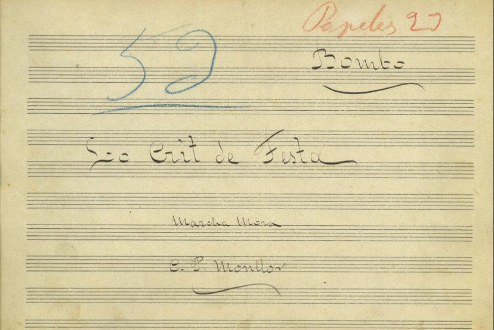

A l’anterior article aprofundírem en la figura de Camilo Pérez Laporta de qui cal destacar també la nissaga de músics alcoians que l’envoltava, tenint aquestos una possible semblança curiosa amb la família Strauss. El seu cosí fou **Julio Laporta Hellín** (1870 – 1928), compositor de reconeguts pasdobles com *Mi Barcelona* o *Un moble més*. Un dels seus fills fou **Evaristo Pérez Monllor** (1880 – 1930\) autor d’obres festeres com *Tristezas y alegrías* o *Mihrab*. Però hui destacarem l’obra del seu altre fill **Camilo Pérez Monllor** (1877 – 1947), diriem que de tots és el més famós ja que baix la seua signatura trobem música festera interpretada de forma contínua com *L’entrà dels moros*, *Moros y Cristians* o *El K’sar el Yedid*. Concretament s’ha trobat una obra dins de l’arxiu la Unió Artística Musical d’Ontinyent una peça festera amb el seu nom anomenada *Lo crit de festa* de la qual es sap més ben poc i sols es troba dins de dit arxiu.  
  
L’obra es podría classificar dins de la música festera com a marxa àrab, un gènere prou comú a l’època que seria un punt mig entre el pasdoble y la marxa mora pel que fa el tempo de la música. Ara bé, aquesta denominació no és la que figura dins dels papers que s’hi troben a l’arxiu on es concreta que és marxa mora. A banda, l’única possible referència que hi ha sobre aquesta peça en algún registre és la que comenten diversos autors al llibre *Diccionario de la música valenciana*. Ací es parla de Pérez Monllor i s’enumera el seu repertori, on Lo crit de festa es qualifica no com una marxa àrab o mora sinó com un pasdoble. Malgrat això, la denominació d’aquesta música apunta ser una marxa àrab, principalment per l’estil de la pròpia obra y el tempo de la mateixa que s’allunya dels altres estils. Pedro Joaquín Francés també recopila l’obra de l’autor i esmenta aquesta peça com a pasdoble. La quasi nul·la informació que hi pot haver és aquesta doncs no té cap dedicatòria ni descripció als papers de l’arxiu, és més, esta única versió es tractaria d’una còpia de l’original que no s’ha localitzat. És possible que fora un regal per a la banda “La lira del Clariano” per part de Pérez Monllor degut a la relació que tenien, de fet seria aquesta còpia el regal i no els manuscrits originals de l’autor.

Destaquem així que és una marxa formalment diferent, ja que, tot i conservar l’essència de l’estructura minuet-trio en la qual es fonamenta bona part de la música festera, s’allunya en alguns aspectes del model tradicional. No presenta un fort final a l’ús, sinó que opta per una progressió creixent. També hi destaquen les modulacions inesperades, que aporten riquesa i sorpresa al discurs musical. Tot i aquestes particularitats, es pot afirmar que l’obra manté plenament l’essència del compositor. La marxa guarda un estil característic de l’època, efectivament Pérez Monllor rep molta influència del seu pare de qui trau diversos motius per fer esta música. El tema principal està dominat per la presència de trompetes amb sordina amb unes línies melòdiques que poden semblar-se a *La canción del harém* (tot i que aquesta no tinga les trompetes amb sordina). Igualment, el trío guarda també similituds amb l’obra *Krouger* de Pérez Laporta però tenint una forma de resoldre’s diferent d’aquest pasdoble.

Lo crit de festa ha sigut una troballa interessant dins del repertori musical fester partint de ser una còpia d’alguna versió perduda. Aquest fet i que sols estiguera disponible a l’arxiu de la Unió Artística Musical d’Ontinyent acaba per caracteritzar esta obra ja que tots els autors que hem comentat eren alcoians. Novament remarquem les relacions que van tindre Camilo Pérez Laporta i el seu fill amb la localitat valldalbaidina, a part de la possibilitat que aquesta obra acabara als arxius de la banda de música d’Ontinyent.

[https://www.instagram.com/p/DU71\_C4krDK/](https://www.instagram.com/p/DU71_C4krDK/)

[https://youtu.be/gBOWAuZF95o?si=aBk0Sf0xrz41PD9Q](https://youtu.be/gBOWAuZF95o?si=aBk0Sf0xrz41PD9Q) Versió del Concert de Mig Any del 2026\.

* Casares Rodicio, E., Galbis López, V., Díaz Gómez, R., & García, J. (2006). *Diccionario de la música valenciana: Labuiga-Zarzuela* (Vols. 1–2). Iberautor.   
* Francés Sanjuán, P. J. (2001). *EL REPERTORIO EN LA MÚSICA PARA LAS FIESTAS DE MOROS Y CRISTIANOS (1882-2000)*. I ENCONTRE DE COMPOSITORS DE MÚSICA PER A MOROS I CRISTIANS, Muro, España.
